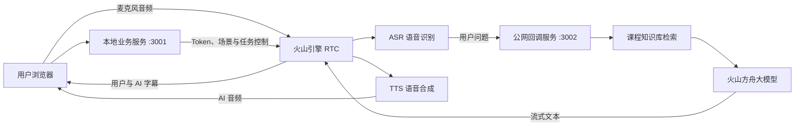

# 懂小智：实时语音 AI 课程顾问

一个可实时语音对话的 RAG 课程顾问项目。用户在浏览器中说话后，系统通过 RTC 传输音频、ASR 识别问题、课程知识库检索资料、方舟大模型生成回答，再由 TTS 播放语音并同步显示字幕。

本项目用于学习和作品集展示，重点是完整串联实时音频、知识检索、大模型与可观测后端，而不是只调用一次聊天接口。

## 已实现能力

- 浏览器麦克风采集与 RTC 房间通信
- ASR 实时语音识别与用户字幕
- 火山方舟大模型流式生成
- 火山知识库语义检索与 RAG 回答约束
- CustomLLM HTTPS 流式回调
- TTS 语音合成与 AI 实时字幕
- 回调 Bearer Token 鉴权与公网接口隔离
- Swagger 调试接口、健康检查和错误日志
- 知识库外问题降级、动态信息转人工、禁止就业承诺

## 系统架构



### 设计说明

- `3001` 是本地业务与调试服务，包含 RTC Token、任务控制和 Swagger，不暴露到公网。
- `3002` 只提供健康检查和带鉴权的 CustomLLM 回调，由 ngrok 暴露给 RTC 云服务。
- `.env` 保存真实凭证并被 Git 忽略；仓库只提交无密钥的 `.env.example`。
- 实时对话默认关闭深度思考，优先保证首包速度和交互自然度。

## 技术栈

- 前端：React、TypeScript、Redux Toolkit、Volcengine RTC Web SDK
- 后端：Python、FastAPI、Uvicorn、HTTPX
- AI：火山方舟大模型、火山知识库 RAG
- 语音：火山引擎 RTC、ASR、TTS
- 开发工具：Swagger UI、ngrok、Git

## 项目结构

```text
.
├── src/                         # React 实时语音交互页面
├── rag_llm_server/
│   ├── main.py                  # 本地业务服务、RTC OpenAPI 代理和调试接口
│   ├── public_callback.py       # 最小化公网回调应用
│   ├── config.py                # 环境变量配置
│   ├── services/
│   │   ├── chat_callback.py     # 回调鉴权与 OpenAI 兼容 SSE
│   │   ├── llm_service.py       # 方舟流式大模型调用
│   │   ├── rag_service.py       # 知识库检索
│   │   └── token_build.py       # RTC Token 生成
│   └── knowledge/               # 演示课程资料
└── docs/
    └── test-results.md          # 端到端验收记录
```

## 本地运行

### 推荐：一键启动

本机完成依赖、`.env` 和 ngrok 认证配置后，在项目根目录运行：

```bash
scripts/dev.sh start
```

脚本会自动启动 ngrok、两个 FastAPI 服务和前端，并将 ngrok 最新 HTTPS 地址安全更新到 `.env`。该命令会留在前台统一托管四个进程，按 `Ctrl-C` 即可全部停止。

其他命令：

```bash
scripts/dev.sh status   # 查看四个进程状态
scripts/dev.sh stop     # 从另一个终端停止全部服务
scripts/dev.sh restart  # 重新启动全部服务
```

`scripts/dev.local` 用于保存本机 Python、Node.js 和 ngrok 可执行文件路径，已被 Git 忽略；可参考 `scripts/dev.local.example`。

下面保留分步启动方式，便于学习每个进程的职责和单独排障。

### 1. 前置条件

- Node.js 16+
- Python 3.10+
- 火山引擎 RTC、语音技术、方舟模型和知识库服务
- ngrok 或其他可访问本机的 HTTPS 隧道

涉及账号授权、资源开通和计费确认的步骤需要在火山引擎控制台手动完成。

### 2. 安装依赖

```bash
npm install

cd rag_llm_server
python3 -m venv .venv
source .venv/bin/activate
pip install -r requirements.txt
```

### 3. 配置环境变量

```bash
cd rag_llm_server
cp .env.example .env
```

根据自己的火山引擎资源填写 `.env`。不要将真实的 `.env`、API Key、Access Key 或 Secret Key 提交到 Git。

关键配置分为五组：

- `VOLC_ACCESS_KEY`、`VOLC_SECRET_KEY`：RTC OpenAPI 与知识库请求签名
- `ARK_ENDPOINT_ID`、`ARK_API_KEY`：方舟在线推理端点
- `RTC_*`：RTC 应用、房间、用户、任务和智能体信息
- `SPEECH_APP_ID`：ASR 与 TTS 应用
- `KB_*`、`VOLC_ACCOUNT_ID`：知识库与账号信息

### 4. 启动公网隧道

```bash
ngrok http 3002
```

将生成的 HTTPS 地址写入 `.env` 的 `SERVER_URL`，例如：

```dotenv
SERVER_URL=https://example.ngrok-free.app
```

### 5. 启动两个 FastAPI 服务

终端一：

```bash
cd rag_llm_server
source .venv/bin/activate
uvicorn main:app --host 127.0.0.1 --port 3001
```

终端二：

```bash
cd rag_llm_server
source .venv/bin/activate
uvicorn public_callback:app --host 127.0.0.1 --port 3002
```

### 6. 启动前端

```bash
PORT=4173 npm start
```

访问：

- 语音页面：<http://127.0.0.1:4173/>
- Swagger：<http://127.0.0.1:3001/docs>
- 健康检查：<http://127.0.0.1:3001/health>

## 调试接口

| 方法 | 路径 | 用途 |
| --- | --- | --- |
| `GET` | `/health` | 检查 RTC、语音、模型、知识库和回调配置 |
| `POST` | `/getScenes` | 为前端生成场景配置和 RTC Token |
| `POST` | `/proxy` | 启动或停止 RTC 智能体任务 |
| `POST` | `/debug/chat` | 独立调试 RAG 与大模型流式回答 |
| `GET` | `/debug/rag` | 查看问题召回的知识片段 |
| `POST` | `/api/chat_callback` | RTC CustomLLM 流式回调 |

## 验收结果

当前端到端测试已经验证：

- 用户语音能够被识别并显示字幕；
- AI 能在 8 秒内返回语音并同步显示文字；
- 课程问题会使用知识库中的资料回答；
- 价格和开班日期等动态信息不会被编造；
- 不承诺就业、薪资或面试结果；
- 天气、股票等知识库外问题会被明确拒绝。

完整记录见 [`docs/test-results.md`](docs/test-results.md)。

作品集录制脚本、简历描述和面试回答提纲见 [`docs/demo-and-resume.md`](docs/demo-and-resume.md)。

### 自动化回归测试

```bash
cd rag_llm_server
python -m unittest discover -s tests -v
```

当前 6 条测试会防止 RTC 权限键序列化、场景机器人身份、ngrok 地址自动更新、代理操作越权和 CORS 范围等问题再次出现。

## 关键问题复盘

1. **RTC Token 报 `token_error`**：Python 权限映射的序列化顺序与官方实现不同，导致签名不一致；改为按数字权限键排序后与官方 Token 一致。
2. **能识别语音但没有回复**：公网隧道进程失效，RTC 无法访问本地 CustomLLM 回调；拆分最小公网回调服务并增加健康检查。
3. **回复延迟约 30 秒**：实时课程咨询不需要长推理；关闭模型深度思考并减少同步日志后，回复降低到 8 秒以内。
4. **有 AI 语音但没有 AI 字幕**：前端 `botName` 与 RTC 智能体用户 ID 不一致，字幕被当成未知用户消息过滤；统一身份配置并开启 RTC 字幕回调。

## 当前限制与下一步

- ngrok 免费地址可能变化，正式部署应使用稳定 HTTPS 域名。
- 当前使用固定房间和任务 ID，适合单人演示；多人并发需要动态会话管理。
- AI 回复可能按语音句号拆成多个气泡，后续可按同一轮对话合并。
- 当前生产构建的主 JavaScript gzip 后约 2.74 MB，可继续通过懒加载和拆包优化首屏体积。
- 下一步可部署到稳定 HTTPS 环境、优化前端拆包，并录制作品集演示视频。

## 项目来源与许可证

前端基于火山引擎实时对话式 AI Demo 二次开发，并新增 FastAPI、RAG、自定义 LLM 回调、安全隔离、测试与课程顾问业务逻辑。原始项目及本仓库代码遵循 BSD-3-Clause 许可证。
